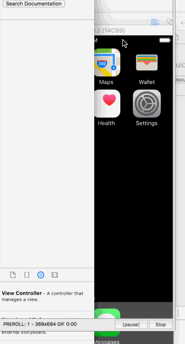

## Roomy

**Roomy** is an app that brings rommmates together into a smarter househould. Roomy's can see whether each other our home or not, send notes to each other, and tell each other that the house really needs toilet paper and a maybe a new succulent wouldn't be a bad idea either.

Time spent: **X** hours spent in total

## User Stories

The following **required** functionality is completed:

- [X] Users can sign up as a "Roomy." 
- [X] Users can create a "House" or join an already created "House."
- [x] User's location is always running in the background
- [x] Google Map API 
- [x] Roomy's can see wether the other roomies are home or not home.

The following **optional** features are implemented:

- [ ] Users can sign up as a "Roomy" with a Facebook or Google third party authentication.  
- [x] A message board.
    - [x] Rommies can compose a message.
    - [ ] Roomy can delete and edit their messages. 
    - [ ] Customized message. 
    - [ ] Filter for customized messages. 
- [x] To-Do / Shopping list. 
    - [x] A roomy can add an to do/shopping item. 
    - [x] A roomy can complete a task and remove it from the list. 
- [x] Roomy Profile 
    - [ ] Profile Picture (Default is from Facebook/Google)
    - [ ] Real name from Facebook/Google
    - [x] Custom username 
    - [ ] A status message 
    - [x] A house to belong to. 
    - [x] Can leave a house and join another house. 
- [ ] House Profile 
    - [ ] Profile Picture 
    - [ ] House username 
    - [ ] Admin 
        - [ ] Default Admin is whomever created the house originally. Only they have the premission to add an admin. 
    - [ ] Location of house. 
- [ ] A roomy can see the distance of how far their roomies are from the house.
- [ ] Roomy can see the time of how long it will take them to get to the house.
    - [ ] Use Google Map Distance Matrix API 
    - [ ] User can customize the type of transportation they use to get home and the time will reflect that 
        chosen transportation.  

The following **additional** features are implemented:

- [ ] List anything else that you can get done to improve the app functionality!

## Wireframes

## Data Schema

## Video Walkthrough 

Here is the updated GIF (3/29):

GIF created with [LiceCap](http://www.cockos.com/licecap/).

## Notes

Describe any challenges encountered while building the app.

## License

Copyright [2017] [Ryan Liszewski | Dustyn August | Poojan Dave | Rodrigo Bell]

Licensed under the Apache License, Version 2.0 (the "License");
you may not use this file except in compliance with the License.
You may obtain a copy of the License at

http://www.apache.org/licenses/LICENSE-2.0

Unless required by applicable law or agreed to in writing, software
distributed under the License is distributed on an "AS IS" BASIS,
WITHOUT WARRANTIES OR CONDITIONS OF ANY KIND, either express or implied.
See the License for the specific language governing permissions and
limitations under the License.
